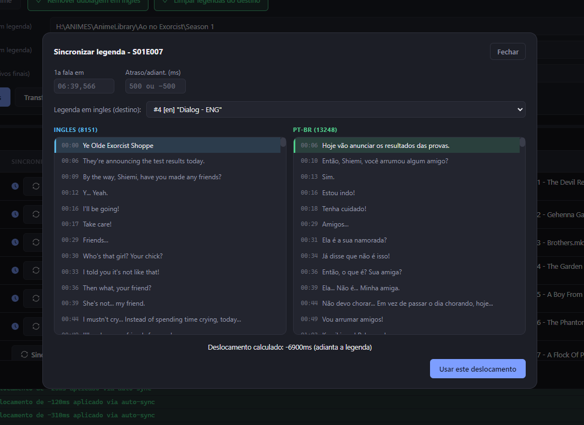
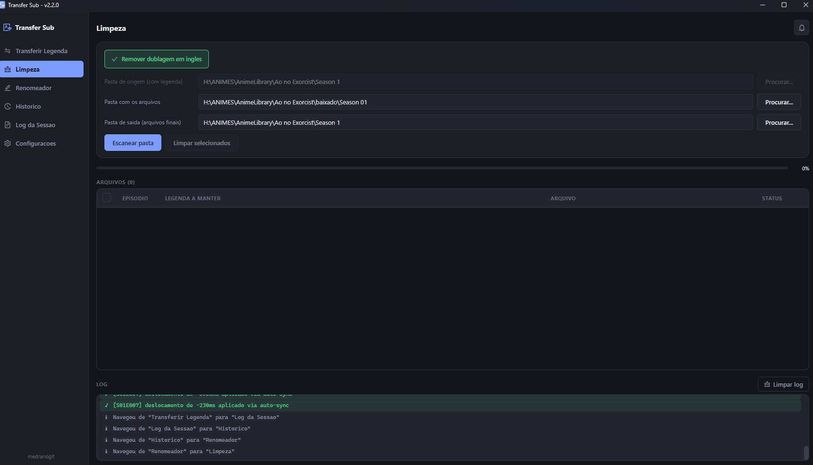
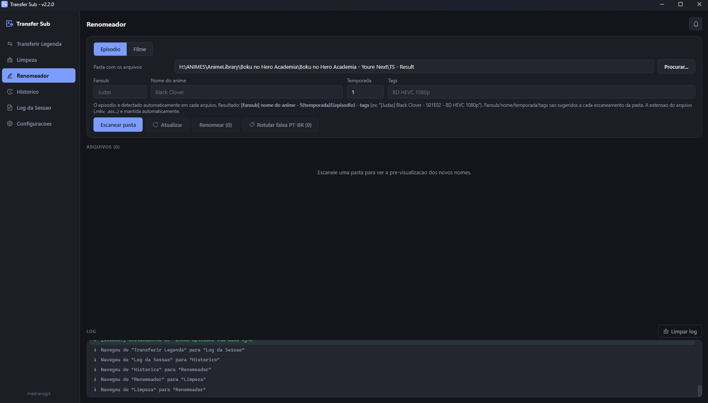
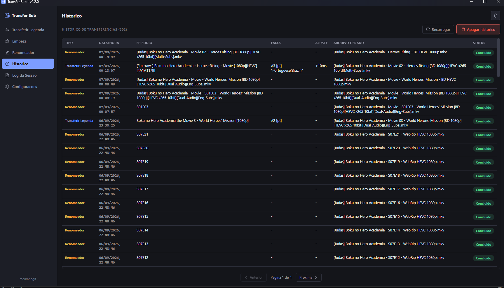

<div align="center">

# 🎬 Transfer Sub

**Transfira legendas ASS/SSA entre arquivos MKV sem abrir o MKVToolNix manualmente episódio por episódio.**

Casa os episódios automaticamente pelo nome do arquivo, detecta as faixas de legenda disponíveis
e já pré-seleciona a legenda em **PT-BR** quando existir.


</div>

## Por que

Fansubs diferentes lançam o mesmo episódio com faixas de legenda diferentes — às vezes você tem uma
release com a legenda em português embutida e quer aproveitá-la em outra release (com melhor
qualidade de vídeo, áudio, etc.). Fazer isso manualmente no MKVToolNix, episódio por episódio,
extraindo e remuxando cada faixa, é tedioso. O Transfer Sub faz isso em lote.

## Funcionalidades

- 🔀 **Seis páginas** no menu lateral: **Transferir Legenda** (entre pastas de origem/destino),
  **Limpeza** (trata os arquivos de uma única pasta, sem transferir nada), **Renomeador**,
  **Histórico**, **Log da Sessão** (log bruto de qualquer sessão anterior do app, gravado em disco
  por sessão) e **Configurações**. O escaneamento de Transferir/Limpeza fica guardado ao trocar de
  página e volta do jeito que estava; o app também impede abrir uma segunda janela ao mesmo tempo
  (foca a já aberta).
- 🎞️ **Modo Filme** — filmes não têm número de episódio pra casar/detectar automaticamente. Um
  alternador **Episódio / Filme** (sempre começa em Episódio) aparece tanto no Transferir Legenda
  quanto no Renomeador: no Transferir, os campos de pasta viram seletor de **arquivo** (origem e
  destino escolhidos direto); no Renomeador, o campo Temporada some e o nome gerado não leva
  `S00E00`.
- ✏️ **Renomeador** — renomeia em lote os vídeos de uma pasta a partir de 4 campos (fansub, nome do
  anime, temporada, tags; o episódio é detectado por arquivo), com auto-detecção **a cada
  escaneamento** (inclusive tags — ex. "BD HEVC 1080p"), fansubs/tags conhecidas configuráveis com
  dropdown de sugestão, um botão **Atualizar** que reaplica os campos sem reler a pasta, e um botão
  separado pra **rotular em lote a faixa de legenda PT-BR** já embutida nos arquivos (edição de
  metadado via `mkvpropedit`, sem remuxar nada).
- 📂 **Casamento automático de episódio** pelo nome do arquivo — reconhece `S01E05`, `1x05`,
  `Episodio 05`, `E05`, e cai num fallback inteligente para nomes de fansub tipo
  `[Grupo] Nome do Show - 05 (1080p) [ABCD1234].mkv`.
- 🔍 **Detecção automática de faixas de legenda** ASS/SSA em cada arquivo, com idioma e nome da
  faixa.
- 🇧🇷 **Seleção automática de PT-BR** — se uma faixa tiver código de idioma `por`/`pt`/`pt-br`/`pob`
  ou o nome contiver palavras como `portugues`, `brasil`, `brazilian`, ela já vem pré-selecionada.
  Qualquer outra faixa continua disponível para trocar manualmente. Se nenhuma faixa bater por
  idioma/nome, o app vasculha o conteúdo de cada legenda em busca de palavras características do
  português e sinaliza no dropdown (`⚠ pode ser PT-BR`) — útil quando o fansub rotulou a faixa com
  o idioma errado.
- 🖋️ **Preserva as fontes da legenda** — copia as fontes customizadas (attachments) anexadas ao
  arquivo de origem, evitando que a legenda ASS perca a formatação por falta da fonte no destino.
- 🏷️ **Renomeia e rotula a faixa transferida como PT-BR** — o nome dado à faixa é configurável em
  Configurações (padrão `Portugues BR`) e o idioma é sempre reforçado como português (`por`),
  mesmo que a faixa original viesse rotulada como indeterminada ou com um código errado. O mesmo
  rótulo pode ser aplicado depois, em lote, a arquivos que já têm legenda embutida (Renomeador).
- 🎧 **Remove dublagem em inglês** (opcional, ligado por padrão) — mantém só o áudio japonês do
  arquivo final.
- 🧹 **Modo limpar** — mantém apenas a legenda escolhida (removendo as demais) e/ou tira a dublagem
  em inglês de uma pasta inteira, sem precisar de uma pasta de origem separada. No modo Transferir
  há a mesma opção ("Limpar legendas do destino, deixando só a transferida").
- ⏱️ **Três formas de ajustar o timing** — informe o instante (`MM:SS,mmm`) em que a primeira fala
  deve aparecer, ou um deslocamento manual em milissegundos, ou use **Sincronizar** para comparar
  lado a lado a legenda em inglês do destino com a PT-BR da origem, clicar na mesma fala nos dois
  lados e deixar o app calcular o deslocamento — as duas legendas são buscadas em paralelo, então o
  modal abre bem mais rápido. Funciona também com legendas **de imagem** (PGS/`.sup`, comuns em BDs)
  quando a faixa em inglês é desse tipo: o app decodifica cada frame e mostra a própria imagem da
  legenda lado a lado, já que não há texto pra comparar. Cada coluna do modal tem um campo de busca
  (aperte **Enter** pra filtrar — não filtra a cada tecla, pra não travar com legendas grandes).
- ⚠️ **Aviso de episódio faltando** — ao escanear uma pasta, se a numeração dos episódios tiver um
  buraco (ex.: do 01 ao 25, falta o 14), aparece um aviso no log e no sino de notificações — fácil
  de não perceber só olhando a tabela quando há muitos arquivos.
- 🔔 **Som de conclusão e de aviso** (silenciável em Configurações) — toca ao terminar uma
  transferência/limpeza, e um som diferente quando um escaneamento traz avisos, episódio faltando
  ou sem correspondência pro sino de notificações.
- 🔎 **Zoom da interface** — `Ctrl` `+`/`Ctrl` `-`/`Ctrl` `0` aumentam, diminuem e restauram o zoom da
  janela (padrão 100%, entre 80% e 120%); cada mudança fica registrada no log.
- 📝 **Log completo** — o painel de log em tela tem botão para limpar e o texto pode ser selecionado/
  copiado; **todo** erro (inclusive os que só apareceriam num modal, como falha ao preparar a
  sincronização) também vai para o log. Cada sessão do app fica gravada num arquivo próprio,
  navegável na página **Log da Sessão** (mais recente primeiro).
- 📁 **Pasta de saída organizada** — os arquivos finais (Transferir/Limpeza) vão para uma subpasta
  criada dentro da pasta de saída escolhida (padrão `TS - Result`, nome configurável em
  Configurações), em vez de direto nela.
- 🧩 **Não sobrescreve com duplicados** — o resultado é sempre salvo com nome fixo por
  episódio/arquivo; rodar de novo substitui o anterior em vez de criar `(1)`, `(2)`, etc. Em
  Configurações dá pra ligar, por modo, uma marcação extra no final do nome (ex: `[legendado]`/
  `[limpo]`, a palavra é livre).
- ⚙️ **Predefinições por tela** — em Configurações dá pra escolher com que o app já abre cada tela:
  Modo Episódio/Filme (Transferir e Renomeador) e as ações padrão (Remover dublagem, Limpar
  legendas) de Transferir/Limpeza — sem precisar reajustar toda vez.
- 💾 **Exportar/Importar configurações** — leva todas as configurações (pastas, predefinições, nome
  da faixa PT-BR, presets do Renomeador...) para outra máquina ou guarda um backup manual, como um
  arquivo `.json`.
- 📂 **Abrir no Explorer** — cada campo de pasta/arquivo tem um botão ao lado de "Procurar..." pra
  abrir a pasta (ou revelar o arquivo) direto no Explorer do Windows.
- 🔄 **Atualização automática** — a versão instalada (`.exe`) verifica sozinha se há uma versão nova
  publicada no GitHub, baixa em segundo plano e pergunta se quer reiniciar agora ou depois — nunca
  reinicia sozinho.
- 📊 Log colorido em tempo real (info/sucesso/aviso/erro) e histórico salvo em
  `transfer-log.json`.

## Instalação e uso

Requer o [MKVToolNix](https://mkvtoolnix.download/) instalado (detectado automaticamente em
`C:\Program Files\MKVToolNix`, ou configurável pela própria interface — precisa achar `mkvmerge.exe`,
`mkvextract.exe` e `mkvpropedit.exe` juntos) e [Node.js](https://nodejs.org/).

```bash
cd ui
npm install
npm run dev
```

**Página Transferir Legenda:**

1. Selecione a **pasta de origem** (arquivos que já têm a legenda embutida) e a **pasta de destino**
   (arquivos que vão receber a legenda) — ou, se for um filme, alterne pra **Filme** no topo e
   escolha os dois **arquivos** direto.
2. Clique em **Escanear pastas** — a tabela mostra cada episódio casado, a faixa de legenda
   detectada (com destaque quando for PT-BR) e o status.
3. Ajuste a faixa de qualquer linha pelo dropdown, se quiser outro idioma. Se precisar corrigir o
   timing, clique em **Sincronizar** — ali dá pra digitar o instante da primeira fala ou um
   deslocamento em ms, ou comparar a legenda em inglês do destino com a PT-BR da origem e deixar o
   app calcular o deslocamento.
4. Clique em **Transferir selecionados**.



**Página Limpeza:**

1. Vá na página **Limpeza** no menu lateral e selecione a pasta com os arquivos.
2. Clique em **Escanear pasta** — a tabela mostra cada arquivo e suas próprias faixas de legenda.
3. Para remover legendas extras, escolha no dropdown qual manter (padrão é manter todas) — o botão
   **Aplicar a todos** no cabeçalho copia a faixa escolhida na 1ª linha pras demais.
4. Clique em **Limpar selecionados**.



**Página Renomeador:**

1. Selecione a pasta com os arquivos (ou alterne pra **Filme** se não houver número de episódio).
2. Clique em **Escanear pasta** — fansub, nome, temporada e tags são detectados automaticamente do
   primeiro arquivo (repete a cada novo escaneamento).
3. Ajuste os campos e clique em **Atualizar** pra ver o resultado sem reler a pasta, ou
   **Renomear** pra aplicar.
4. Pra corrigir o rótulo da legenda PT-BR já embutida nos arquivos (sem mexer no nome do arquivo),
   use o botão **Rotular faixa PT-BR**.



Toda transferência/limpeza/renomeação fica registrada na página **Histórico**:



Quer gerar um instalador `.exe` em vez de rodar em modo desenvolvimento?

```bash
npm run dist
```

Ou, pra publicar uma release já pronta no GitHub (build automático), basta empurrar uma tag `vX.Y.Z`
que bata com o `version` de `ui/package.json` — o workflow em
[`.github/workflows/release.yml`](.github/workflows/release.yml) builda num runner Windows e sobe o
instalador como asset da Release.

```bash
git tag v2.3.0
git push origin v2.3.0
```

## Arquitetura

O projeto inteiro vive em [`ui/`](ui/). O processo principal do Electron separa regra de negócio
pura (dominio) de tudo que toca o sistema de arquivos ou dispara processos externos (infra):

```
ui/src/
  main/
    domain/     regras puras, sem I/O — casar episódio, reconhecer PT-BR/áudio em inglês, timing,
                gerar/detectar os campos do Renomeador
    infra/      I/O — localizar o MKVToolNix, listar vídeos, rodar mkvmerge/mkvextract/mkvpropedit,
                config, log
    workflow.ts casos de uso (escanear/transferir, escanear/limpar, escanear filme, rotular faixa)
                orquestrando domain + infra
    renamer.ts  caso de uso do Renomeador
    index.ts    único ponto que conhece Electron/IPC
  preload/      ponte contextBridge exposta como window.api
  renderer/     UI em React, dividida por responsabilidade:
                App.tsx        orquestrador (estado + handlers), monta a tela
                theme.ts        tema (cores/spacing) + tipagem do styled-components
                ui/             primitivas genericas reaproveitaveis (Button, Row, Chip,
                                EpisodeMovieToggle...)
                components/     um arquivo por peca com estado/logica propria (EpisodeTable,
                                SyncModal, LogPanel...)
                utils/          funcoes puras (formatacao de legenda/timing, som de conclusao/aviso)
  shared/       tipos TypeScript compartilhados entre as camadas
```

Mais detalhes em [`ui/README.md`](ui/README.md).

## Stack

Electron · React · TypeScript · styled-components · Ant Design Icons ·
MKVToolNix (`mkvmerge` / `mkvextract` / `mkvpropedit`)

## Licenca

[MIT](LICENSE) — copyright (c) 2026 Vinicius Medrano.
