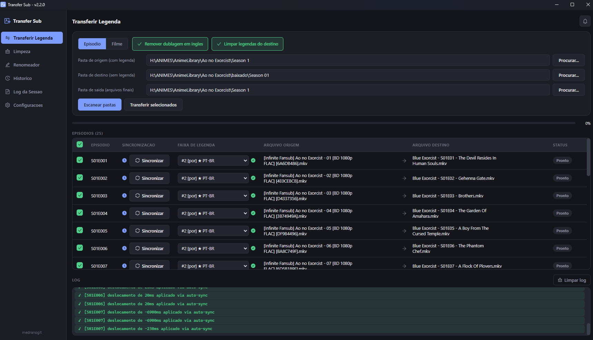

<div align="center">

# 🎬 Transfer Sub

**Transfira legendas ASS/SSA entre arquivos MKV sem abrir o MKVToolNix manualmente episódio por episódio.**

Casa os episódios automaticamente pelo nome do arquivo, detecta as faixas de legenda disponíveis
e já pré-seleciona a legenda em **PT-BR** quando existir.




</div>

## Por que

Fansubs diferentes lançam o mesmo episódio com faixas de legenda diferentes — às vezes você tem uma
release com a legenda em português embutida e quer aproveitá-la em outra release (com melhor
qualidade de vídeo, áudio, etc.). Fazer isso manualmente no MKVToolNix, episódio por episódio,
extraindo e remuxando cada faixa, é tedioso. O Transfer Sub faz isso em lote.

## Funcionalidades

- 🔀 **Dois modos**, num seletor no topo da tela: **Transferir legenda** (entre pastas de
  origem/destino) ou **Apenas limpar** (trata os arquivos de uma única pasta, sem transferir nada).
- 📂 **Casamento automático de episódio** pelo nome do arquivo — reconhece `S01E05`, `1x05`,
  `Episodio 05`, `E05`, e cai num fallback inteligente para nomes de fansub tipo
  `[Grupo] Nome do Show - 05 (1080p) [ABCD1234].mkv`.
- 🔍 **Detecção automática de faixas de legenda** ASS/SSA em cada arquivo, com idioma e nome da
  faixa.
- 🇧🇷 **Seleção automática de PT-BR** — se uma faixa tiver código de idioma `por`/`pt`/`pt-br`/`pob`
  ou o nome contiver palavras como `portugues`, `brasil`, `brazilian`, ela já vem pré-selecionada.
  Qualquer outra faixa continua disponível para trocar manualmente. Se nenhuma faixa bater por
  idioma/nome, o app vasculha o conteúdo de cada legenda em busca de palavras características do
  português e sinaliza no dropdown (`⚠ pode ser PT-BR`) — útil quando o fansub rotulou a faixa com
  o idioma errado.
- 🖋️ **Preserva as fontes da legenda** — copia as fontes customizadas (attachments) anexadas ao
  arquivo de origem, evitando que a legenda ASS perca a formatação por falta da fonte no destino.
- 🏷️ **Renomeia a faixa transferida** — a legenda PT-BR transferida vira `PortuguesBr - TransferSub`
  com idioma indeterminado (`und`), pra identificar facilmente no player sem repetir "[Português]"
  no nome que já é autoexplicativo.
- 🎧 **Remove dublagem em inglês** (opcional, ligado por padrão) — mantém só o áudio japonês do
  arquivo final.
- 🧹 **Modo limpar** — mantém apenas a legenda escolhida (removendo as demais) e/ou tira a dublagem
  em inglês de uma pasta inteira, sem precisar de uma pasta de origem separada. No modo Transferir
  há a mesma opção ("Limpar legendas do destino, deixando só a transferida").
- ⏱️ **Três formas de ajustar o timing** — informe o instante (`MM:SS,mmm`) em que a primeira fala
  deve aparecer, ou um deslocamento manual em milissegundos, ou use **Sincronizar** para comparar
  lado a lado a legenda em inglês do destino com a PT-BR da origem, clicar na mesma fala nos dois
  lados e deixar o app calcular o deslocamento.
- 🧩 **Não sobrescreve com duplicados** — o resultado é sempre salvo com nome fixo por
  episódio/arquivo (`Nome [legendado].mkv` ou `Nome [limpo].mkv`); rodar de novo substitui o
  anterior em vez de criar `(1)`, `(2)`, etc.
- 📊 Log colorido em tempo real (info/sucesso/aviso/erro), som de conclusão e histórico salvo em
  `transfer-log.json`.

## Instalação e uso

Requer o [MKVToolNix](https://mkvtoolnix.download/) instalado (detectado automaticamente em
`C:\Program Files\MKVToolNix`, ou configurável pela própria interface) e [Node.js](https://nodejs.org/).

```bash
cd ui
npm install
npm run dev
```

**Modo Transferir legenda:**

1. Selecione a **pasta de origem** (arquivos que já têm a legenda embutida) e a **pasta de destino**
   (arquivos que vão receber a legenda).
2. Clique em **Escanear pastas** — a tabela mostra cada episódio casado, a faixa de legenda
   detectada (com destaque quando for PT-BR) e o status.
3. Ajuste a faixa de qualquer linha pelo dropdown, se quiser outro idioma. Se precisar corrigir o
   timing, clique em **Sincronizar** — ali dá pra digitar o instante da primeira fala ou um
   deslocamento em ms, ou comparar a legenda em inglês do destino com a PT-BR da origem e deixar o
   app calcular o deslocamento.
4. Clique em **Transferir selecionados**.

**Modo Apenas limpar:**

1. Troque o seletor de modo para **Apenas limpar** e selecione a pasta com os arquivos.
2. Clique em **Escanear pasta** — a tabela mostra cada arquivo e suas próprias faixas de legenda.
3. Para remover legendas extras, escolha no dropdown qual manter (padrão é manter todas).
4. Clique em **Limpar selecionados**.

Quer gerar um instalador `.exe` em vez de rodar em modo desenvolvimento?

```bash
npm run dist
```

## Arquitetura

O projeto inteiro vive em [`ui/`](ui/). O processo principal do Electron separa regra de negócio
pura (dominio) de tudo que toca o sistema de arquivos ou dispara processos externos (infra):

```
ui/src/
  main/
    domain/     regras puras, sem I/O — casar episódio, reconhecer PT-BR/áudio em inglês, timing
    infra/      I/O — localizar o MKVToolNix, listar vídeos, rodar mkvmerge/mkvextract, config, log
    workflow.ts casos de uso (escanear/transferir, escanear/limpar) orquestrando domain + infra
    index.ts    único ponto que conhece Electron/IPC
  preload/      ponte contextBridge exposta como window.api
  renderer/     UI em React, dividida por responsabilidade:
                App.tsx        orquestrador (estado + handlers), monta a tela
                theme.ts        tema (cores/spacing) + tipagem do styled-components
                ui/             primitivas genericas reaproveitaveis (Button, Row, Chip...)
                components/     um arquivo por peca com estado/logica propria (EpisodeTable,
                                SyncModal, LogPanel...)
                utils/          funcoes puras (formatacao de legenda/timing, som de conclusao)
  shared/       tipos TypeScript compartilhados entre as camadas
```

Mais detalhes em [`ui/README.md`](ui/README.md).

## Stack

Electron · React · TypeScript · styled-components · Ant Design Icons · MKVToolNix (`mkvmerge` / `mkvextract`)
